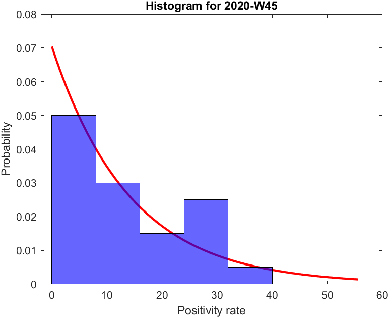
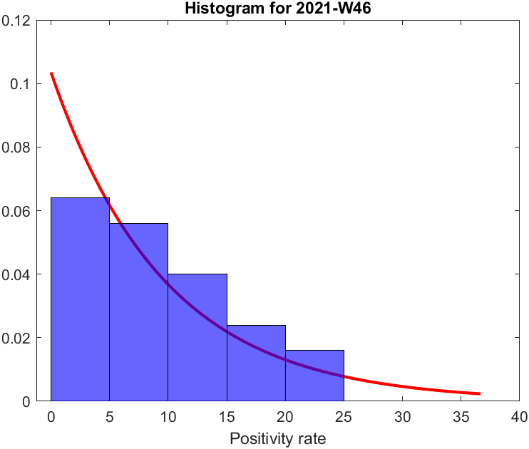
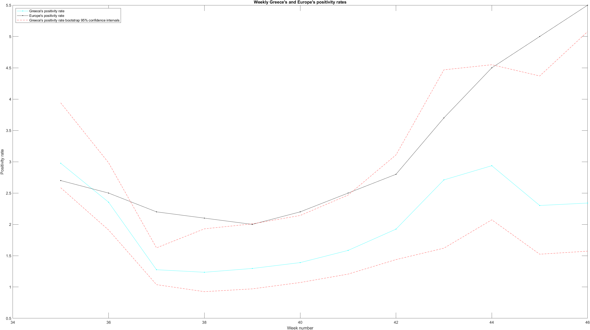
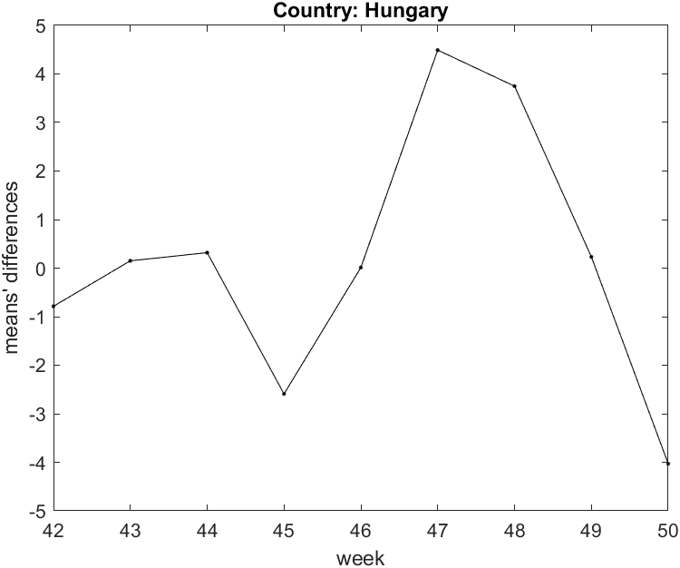
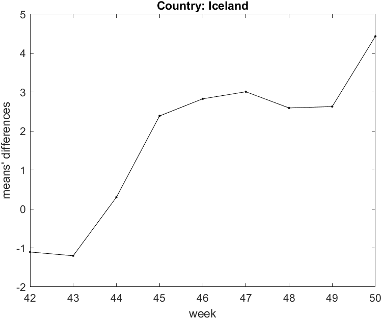
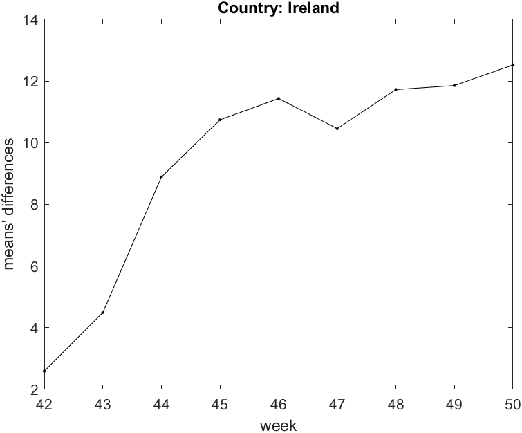
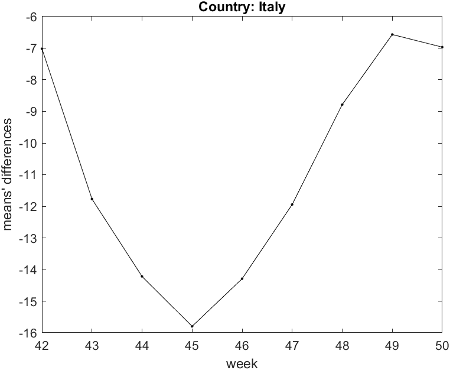
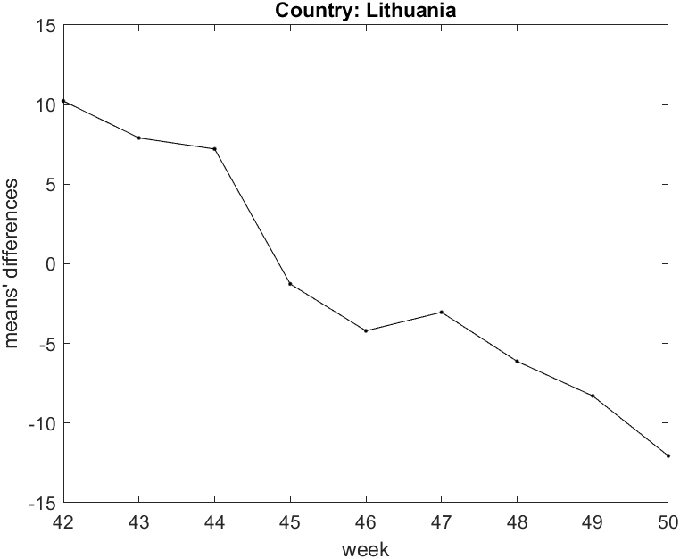
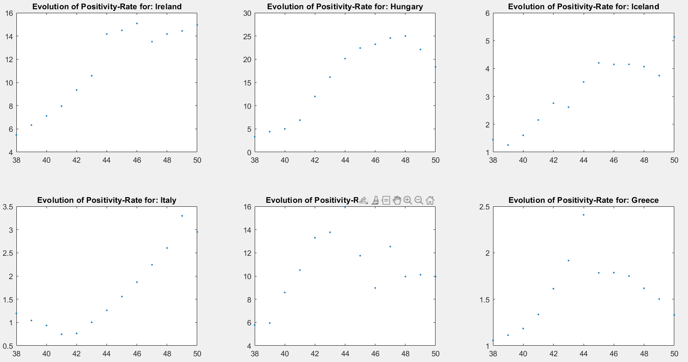

### Data Analysis: Covid-19
#### Εισαγωγή
Το παρόν project συσχετίζεται με το πανεπιστημιακό μάθημα Ανάλυση δεδομένων (7ο εξάμηνο) του τμήματος Ηλεκτρολόγων Μηχανικών και Μηχανικών Υπολογιστών του ΑΠΘ. Έχει χρησιμοποιηθεί η γλώσσα Matlab. Ορισμένα αρχεία περιέχουν βοηθητικές συναρτήσεις (αρχεία func), οι οποίες χρησιμοποιούνται στα κύρια αρχεία (αρχεία prog). Όλα τα αρχεία συνοδεύονται από βοηθητικά σχόλια για την επεξήγηση του κώδικα. Τα αρχεία .xlsx περιέχουν στοιχεία για την πανδημία του covid-19 και έχουν ληφθεί από την ιστοσελίδα [https://www.stelios67pi.eu](https://www.stelios67pi.eu).  
Το αρχείο _ECDC-7Days-Testing.xlsx_ έχει εβδομαδιαία δεδομένα για διάφορες χώρες της ευρωπαϊκής ένωσης σχετικά με την πανδημία, ενώ το αρχείο _FullEodyData.xlsx_ παρέχει αναλυτικότερες πληροφορίες για την πανδημία στην Ελλάδα. Τέλος, το αρχείο _EuropeanCountries.xlsx_ περιλαμβάνει μια λίστα με όλες τις ευρωπαϊκές χώρες για τις οποίες έχουμε δεδομένα.
Η εργασία αυτή ασχολείται κυρίως με την Ιρλανδία και την Ελλάδα, ωστόσο οι συναρτήσεις που χρησιμοποιούνται μπορούν με μικρές αλλαγές να προσαρμοστούν σε οποιαδήποτε άλλη επιθυμητή χώρα.  
Τέλος, το αρχείο με το όνομα _Project2021.pdf_ είναι η εκφώνηση της εργασίας όπως μας παραδόθηκε από τον διδάσκοντα του μαθήματος.

#### Άσκηση 1
Στο ερώτημα αυτό δείχνουμε το δείκτη θετικότητας των χωρών για δύο διαφορετικές εβδομάδες. Τα αποτελέσματα που προκύπτουν φαίνονται στα παρακάτω ιστογράμματα:

Η ακολουθή εικόνα είναι μια σύγκριση μεταξύ των δύο κατανομών που προέκυψαν για την κάθε εβδομάδα, για να απαντήσουμε αν μπορούν να προσεγγιστούν από μία κοινή κατανομή.

#### Άσκηση 3
Εδώ θέλουμε να δούμε πότε ο εβδομαδιαίος δείκτης θετικότητας της Ελλάδας είναι στατιστικά  σημαντικά διαφορετικός  από αυτόν της Ευρωπαικής Ένωσης. Τα αποτελέσματα του ερωτήματος δίνονται στο παρακάτω διάγραμμα, όπου έχουν σημειωθεί και τα επιτρεπτά όρια απόκλισης μεταξύ των δύο τιμών, τα οποία είναι τα 95% διαστήματα εμπιστοσύνης κατά bootstrap:

Παρατηρούμε πως ο δείκτης θετικότητας δε μπορεί να θεωρηθεί ίδιος σε όλες τις περιπτώσεις, όπως πχ στις εβδομάδες 37 και 38.

#### Άσκηση 4
Τώρα συγκρίνουμε τη συμπεριφορά του δείκτη θετικότητας για κάποιες χώρες, για συγκεκριμένες βδομάδες των 2020 και 2021 για να δούμε αν είναι παρόμοια. Στα παρακάτω διαγράμματα των αποτελεσμάτων βλέπουμε με τη διάφορα των μέσων τιμών αν ισχύει αυτό (θέλουμε μέση τιμή κοντά στο 0). Ακολουθούν διαγράμματα για τις χώρες Ουγγαρία, Ισλανδία, Ιρλανδία, Ιταλία και Λιθουανία:

Ακόμη και για αυτό το μικρό δείγμα χωρών η συμπεριφορά είναι χαοτική. Χώρες όπως η Ιρλανδία έχουν εμφανώς μεγαλύτερο δείκτη θετικότητας για το έτος 2021, εν αντιθέσει με χώρες σαν την Ιταλία που ισχύει το αντίθετο. Βέβαια υπάρχουν και χώρες, όπως για παράδειγμα η Ουγγαρία, όπου η συμπεριφορά μπορεί να θεωρηθεί παρόμοια ανάμεσα στα δύο έτη που μελετάμε.

#### Άσκηση 5
Ζητούμενο σε αυτό το ερώτημα είναι η εύρεση της συσχέτισης των δεικτών θετικότητας μεταξύ της Ελλάδας και των χωρών από το προηγούμενο ερώτημα. Πραγματοποιείται ο υπολογισμός του δείκτη συσχέτισης pearson και έλεγχος σημαντικότητας του συντελεστή αυτού, τόσο παραμετρικά όσο και τυχαιοποιημένα.
Τα αποτελέσματα που προκύπτουν είναι τα εξής:

#### Correlation factors between Greece and foreign countries ( Parametric )
The pearson correlation between Greece and Ireland is rho = 0.65.  
The pearson correlation between Greece and Hungary is rho = 0.68.  
The pearson correlation between Greece and Iceland is rho = 0.50.  
The pearson correlation between Greece and Italy is rho = 0.04.  
The pearson correlation between Greece and Lithuania is rho = 0.87.

#### Significance Test for correlation about weekly positivity rate between Greece and foreign countries, using sigificance level of a =0.05 .

The p-value for hypothesis testing of no correlation is less than alpha=0.05. So there is  proof that there is correlation between Greece and Ireland weekly positivity rate.  
The p-value is 0.01655  
The p-value for hypothesis testing of no correlation is less than alpha=0.05. So there is  proof that there is correlation between Greece and Hungary weekly positivity rate.  
The p-value is 0.01009  
The p-value for hypothesis testing of no correlation is greater than alpha=0.05. So there is no proof that there is correlation between Greece and Iceland weekly positivity rate.  
The p-value is 0.07963  
The p-value for hypothesis testing of no correlation is greater than alpha=0.05. So there is no proof that there is correlation between Greece and Italy weekly positivity rate.  
The p-value is 0.88919  
The p-value for hypothesis testing of no correlation is less than alpha=0.05. So there is  proof that there is correlation between Greece and Lithuania weekly positivity rate.  
The p-value is 0.00011

#### Significance Test for correlation about weekly positivity rate between Greece and foreign countries, using sigificance level of a =0.01 .
The p-value for hypothesis testing of no correlation is greater than alpha=0.01. So there no is proof that there is correlation between Greece and Ireland weekly positivity rate.  
The p-value is 0.01655  
The p-value for hypothesis testing of no correlation is greater than alpha=0.01. So there no is proof that there is correlation between Greece and Hungary weekly positivity rate.  
The p-value is 0.01009  
The p-value for hypothesis testing of no correlation is greater than alpha=0.01. So there no is proof that there is correlation between Greece and Iceland weekly positivity rate.  
The p-value is 0.07963  
The p-value for hypothesis testing of no correlation is greater than alpha=0.01. So there no is proof that there is correlation between Greece and Italy weekly positivity rate.  
The p-value is 0.88919  
The p-value for hypothesis testing of no correlation is less than alpha=0.01. So there is  proof that there is correlation between Greece and Lithuania weekly positivity rate.  
The p-value is 0.00011

#### Correlation factors between Greece and foreign countries ( Randomization )
The pearson correlation between Greece and Ireland is rho = 0.65.  
The pearson correlation between Greece and Hungary is rho = 0.68.  
The pearson correlation between Greece and Iceland is rho = 0.50.  
The pearson correlation between Greece and Italy is rho = 0.04.  
The pearson correlation between Greece and Lithuania is rho = 0.87.

#### Significance Test for correlation about weekly positivity rate between Greece and foreign countries, using sigificance level of a =0.05 .
The p-value for hypothesis testing of no correlation is less than alpha=0.05. So there is  proof that there is correlation between Greece and Ireland weekly positivity rate.  
The p-value is 0.02997  
The p-value for hypothesis testing of no correlation is less than alpha=0.05. So there is  proof that there is correlation between Greece and Hungary weekly positivity rate.  
The p-value is 0.00599  
The p-value for hypothesis testing of no correlation is greater than alpha=0.05. So there is no proof that there is correlation between Greece and Iceland weekly positivity rate.  
The p-value is 0.10190  
The p-value for hypothesis testing of no correlation is greater than alpha=0.05. So there is no proof that there is correlation between Greece and Italy weekly positivity rate.  
The p-value is 0.86713  
The p-value for hypothesis testing of no correlation is less than alpha=0.05. So there is  proof that there is correlation between Greece and Lithuania weekly positivity rate.  
The p-value is 0.00000

#### Significance Test for correlation about weekly positivity rate between Greece and foreign countries, using sigificance level of a =0.01 .
The p-value for hypothesis testing of no correlation is greater than alpha=0.01. So there no is proof that there is correlation between Greece and Ireland weekly positivity rate.  
The p-value is 0.02997  
The p-value for hypothesis testing of no correlation is less than alpha=0.01. So there is  proof that there is correlation between Greece and Hungary weekly positivity rate.  
The p-value is 0.00599  
The p-value for hypothesis testing of no correlation is greater than alpha=0.01. So there no is proof that there is correlation between Greece and Iceland weekly positivity rate.  
The p-value is 0.10190  
The p-value for hypothesis testing of no correlation is greater than alpha=0.01. So there no is proof that there is correlation between Greece and Italy weekly positivity rate.  
The p-value is 0.86713  
The p-value for hypothesis testing of no correlation is less than alpha=0.01. So there is  proof that there is correlation between Greece and Lithuania weekly positivity rate.  
The p-value is 0.00000

#### Graph of the Positivity Rate for the countries under examination

#### Άσκηση 6
Σε αυτό το ερώτημα επιθυμούμε να ελέγξουμε εάν, για τις δύο χώρες όπου ο δείκτης θετικότητας συσχετίζεται περισσότερο με αυτόν της Ελλάδας, η διαφορά των αντίστοιχων συντελεστών είναι στατιστικά σημαντική.
Έπειτα από χρήση της τεχνικής bootstrap για να εξάγουμε το rank καταλήγουμε στο κάτωθι συμπέρασμα:   
The rank of the original difference of correlation factors between Greece and the other two countries (Hungary, Lithuania) is included in the acceptance area.
So we cannot reject the null Hypothesis, at a significance level of a=0.05. In that case we can say that there is no significant difference between the two correlation factors.

#### Άσκηση 7

The most effective models for the two samples

Sample 1: The best model is to take a delay of 0 weeks.
The R-square statistic to this choice is R^2 = 0.94852

Sample 2: The best model is to take a delay of 1 weeks.
The R-square statistic to this choice is R^2 = 0.90469

#### Στοιχεία φοιτητών:
1.  Κωνσταντίνος Γερογιάννης  
email: kostas.gerogiannis04@gmail.com  
github: [kostaGRG](https://github.com/kostaGRG)

2. Σταύρος Τσιμπούκης
email: tsimpous@ece.auth.gr
