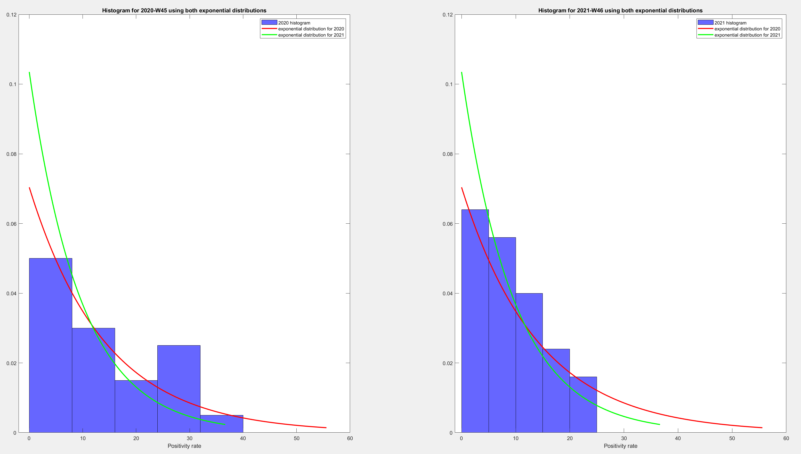

## Data Analysis: Covid-19
### Description
The project includes a series of questions related to the COVID-19 pandemic. The data you will use are provided in the files: 1) ECDC-7Days-Testing.xlsx and 2) FullEodyData.xlsx. Both files are from the website https://www.stelios67pi.eu, where there are also many other data that you may want to extract. The first file contains weekly data on the number of cases and tests, and mainly the positivity rate (positivity_rate column) for European countries as recorded by the European Center for Disease Prevention and Control (ECDC). The second file contains various data and indicators related to COVID-19 for Greece on a daily basis, such as tests and cases, hospitalizations in regular beds and intensive care units (ICU), deaths, etc.

In the project questions referring to a European country from the 25 European countries listed in the file EuropeanCountries.xlsx, you will designate that country according to your team's number. The corresponding country for the team is the one with the ascending number equal to the remainder of the division of one member's ID number by 25, increased by one. If there are unsatisfactory data for the project questions from the initially designated European country, another neighboring European country may be used. For example, for an ID number of 9876, the ascending country number is 2, corresponding to Belgium. Let's call the country you choose as Country A.

The team may also draw data for the project questions from other sources if it deems them to be more easily processed or more accurate and better updated.

### Introduction
This project is associated with the university course Data Analysis (7th semester) of the Department of Electrical and Computer Engineering at the Aristotle University of Thessaloniki (AUTh). The Matlab language has been used. Some files contain auxiliary functions (func files), which are used in the main files (prog files). All files are accompanied by helpful comments for explaining the code. The .xlsx files contain data about the COVID-19 pandemic and have been obtained from the website https://www.stelios67pi.eu.
The file ECDC-7Days-Testing.xlsx has weekly data for various countries of the European Union regarding the pandemic, while the file FullBodyData.xlsx provides more detailed information about the pandemic in Greece. Finally, the file EuropeanCountries.xlsx includes a list of all the European countries for which we have data.
This work mainly deals with Ireland and Greece, however, the functions used can be adapted with minor changes to any other desired country.
Lastly, the file named Project2021.pdf is the assignment description as it was given to us by the course instructor.

### Tasks/Solutions

#### Task 1
Distribution of the Positivity Index: What is the distribution of the positivity index in European countries for two specific dates (on a weekly basis)? Is there any known parametric distribution that can approximate it? To answer these questions, you will use all 25 European countries listed in the EuropeanCountries.xlsx file and consider two different dates (weeks) in the ECDC-7Days-Testing.xlsx file: 1) one of the last 6 weeks of 2021 (W45-W50) in which the positivity index of Country A is the highest and 2) the same for the corresponding 6 weeks of 2020 (W45-W50). You will create histograms of the positivity index from the 25 countries for these two dates. You will fit a suitable known parametric distribution (normal, uniform, exponential, see also the fitdist function) and investigate to what extent the two distributions for the two dates can (or cannot) be satisfactorily described by the same parametric distribution. Your answer here can be simply based on the appropriate graphs of the parametric distributions on the corresponding histograms.

#### Solution 1
In this question, we show the positivity rate of the countries for two different weeks. The results are presented in the following histograms:

The following image is a comparison between the two distributions that resulted for each week, to answer whether they can be approximated by a common distribution.

#### Task 3
When is Greece's Weekly Positivity Index Statistically Significantly Different from that of the European Union (EU)? To answer this question, first create a function that provides the answer for any given week. The daily values of the positivity index for Greece can be calculated from the daily tests (rapid and PCR in columns AS and AT respectively in the FullEodyData.xlsx file) and the daily new cases (in column B of the same file). The weekly positivity index is the average of the positivity index over the 7 days of the week. You can calculate the weekly positivity index for the EU from the values of the weekly positivity indices of the 25 countries given in the ECDC-7Days-Testing.xlsx file or more easily by reading the values from the corresponding graph on the website https://www.stelios67pi.eu/testing.html.

The function will take the 7 consecutive daily values of the positivity index in Greece for a specific week and the corresponding weekly positivity index for the EU, calculate the 95% bootstrap confidence interval for the average positivity index in Greece for a week (7 days), and the answer as to whether it differs with statistical significance will be given by comparing the value of the EU's weekly positivity index with the confidence interval. The function output should also indicate the sign of the difference if there is one. In a program, you will perform the calculations for a period of 12 consecutive weeks (calling the function 12 times) from the week of the last peak of the positivity index of Country A and backwards (the data for Country A are in the ECDC-7Days-Testing.xlsx file). The program should create a chart for the weekly positivity index for Greece and the EU for the period of interest and mark/show in some way the statistically significant differences.

#### Solution 3
Here, we want to determine when the weekly positivity index of Greece is statistically significantly different from that of the European Union. The results of the question are given in the following diagram, where the permissible deviation limits between the two values are also marked, which are the 95% bootstrap confidence intervals:

We observe that the positivity rate cannot be considered the same in all cases, such as in weeks 37 and 38.

#### Task 4
Are There Significant Differences in the Positivity Index in Europe in the Last Two Months Compared to the Same Period in 2020? To answer this question for Country A, you will compare the average weekly positivity index over two-month periods, namely W42-W50 for both 2021 and 2020. The comparison will be done using an appropriate parametric test and a bootstrap or randomization test. Repeat the same tests for four other countries that are alphabetically adjacent to Country A in the list of 25 European countries. Is there agreement in the results of the comparisons across these 5 countries?

#### Solution 4
Now we compare the behavior of the positivity rate for certain countries, for specific weeks of 2020 and 2021, to see if they are similar. In the following diagrams of the results, we observe the difference in the mean values to determine if this is true (we are looking for a mean value close to 0). The diagrams for the countries Hungary, Iceland, Ireland, Italy, and Lithuania follow:

Even for this small sample of countries, the behavior is chaotic. Countries like Ireland have a noticeably higher positivity rate for the year 2021, in contrast to countries like Italy where the opposite is true. However, there are countries, such as Hungary, where the behavior can be considered similar between the two years we are studying.

#### Task 5
With Which of the 5 European Countries is the Trend of Greece's Weekly Positivity Index Most Correlated Over the Last Quarter? To answer this question, you will consider the same 5 countries used in Task 4 and the 3-month period, specifically W38-W50 for 2021. You will chart the trend of the 5 weekly positivity indexes for the period of interest. Calculate the Pearson correlation coefficient for the pair of the weekly positivity index of Greece with each of the 5 countries. You will also conduct a test for the significance of the correlation coefficient, both parametrically and by randomization, for each of the 5 country pairs at significance levels α=0.05 and α=0.01. Is there a statistically significant correlation, and with which country is it the greatest?

#### Solution 5
The objective of this question is to find the correlation of the positivity rates between Greece and the countries from the previous question. The calculation of the Pearson correlation coefficient is performed, and the significance of this coefficient is checked, both parametrically and randomly.
The results are as follows:

##### Correlation factors between Greece and foreign countries ( Parametric )
The pearson correlation between Greece and Ireland is rho = 0.65.  
The pearson correlation between Greece and Hungary is rho = 0.68.  
The pearson correlation between Greece and Iceland is rho = 0.50.  
The pearson correlation between Greece and Italy is rho = 0.04.  
The pearson correlation between Greece and Lithuania is rho = 0.87.

##### Significance Test for correlation about weekly positivity rate between Greece and foreign countries, using sigificance level of a =0.05 .

The p-value for hypothesis testing of no correlation is less than alpha=0.05. So there is  proof that there is correlation between Greece and Ireland weekly positivity rate.  
The p-value is 0.01655  

The p-value for hypothesis testing of no correlation is less than alpha=0.05. So there is  proof that there is correlation between Greece and Hungary weekly positivity rate.  
The p-value is 0.01009  

The p-value for hypothesis testing of no correlation is greater than alpha=0.05. So there is no proof that there is correlation between Greece and Iceland weekly positivity rate.  
The p-value is 0.07963  

The p-value for hypothesis testing of no correlation is greater than alpha=0.05. So there is no proof that there is correlation between Greece and Italy weekly positivity rate.  
The p-value is 0.88919  

The p-value for hypothesis testing of no correlation is less than alpha=0.05. So there is  proof that there is correlation between Greece and Lithuania weekly positivity rate.  
The p-value is 0.00011

##### Significance Test for correlation about weekly positivity rate between Greece and foreign countries, using sigificance level of a =0.01 .
The p-value for hypothesis testing of no correlation is greater than alpha=0.01. So there no is proof that there is correlation between Greece and Ireland weekly positivity rate.  
The p-value is 0.01655  

The p-value for hypothesis testing of no correlation is greater than alpha=0.01. So there no is proof that there is correlation between Greece and Hungary weekly positivity rate.  
The p-value is 0.01009  

The p-value for hypothesis testing of no correlation is greater than alpha=0.01. So there no is proof that there is correlation between Greece and Iceland weekly positivity rate.  
The p-value is 0.07963  

The p-value for hypothesis testing of no correlation is greater than alpha=0.01. So there no is proof that there is correlation between Greece and Italy weekly positivity rate.  
The p-value is 0.88919  

The p-value for hypothesis testing of no correlation is less than alpha=0.01. So there is  proof that there is correlation between Greece and Lithuania weekly positivity rate.  
The p-value is 0.00011

##### Correlation factors between Greece and foreign countries ( Randomization )
The pearson correlation between Greece and Ireland is rho = 0.65.  
The pearson correlation between Greece and Hungary is rho = 0.68.  
The pearson correlation between Greece and Iceland is rho = 0.50.  
The pearson correlation between Greece and Italy is rho = 0.04.  
The pearson correlation between Greece and Lithuania is rho = 0.87.

##### Significance Test for correlation about weekly positivity rate between Greece and foreign countries, using sigificance level of a =0.05 .
The p-value for hypothesis testing of no correlation is less than alpha=0.05. So there is  proof that there is correlation between Greece and Ireland weekly positivity rate.  
The p-value is 0.02997  

The p-value for hypothesis testing of no correlation is less than alpha=0.05. So there is  proof that there is correlation between Greece and Hungary weekly positivity rate.  
The p-value is 0.00599  

The p-value for hypothesis testing of no correlation is greater than alpha=0.05. So there is no proof that there is correlation between Greece and Iceland weekly positivity rate.  
The p-value is 0.10190  

The p-value for hypothesis testing of no correlation is greater than alpha=0.05. So there is no proof that there is correlation between Greece and Italy weekly positivity rate.  
The p-value is 0.86713  

The p-value for hypothesis testing of no correlation is less than alpha=0.05. So there is  proof that there is correlation between Greece and Lithuania weekly positivity rate.  
The p-value is 0.00000

##### Significance Test for correlation about weekly positivity rate between Greece and foreign countries, using sigificance level of a =0.01 .
The p-value for hypothesis testing of no correlation is greater than alpha=0.01. So there no is proof that there is correlation between Greece and Ireland weekly positivity rate.  
The p-value is 0.02997  

The p-value for hypothesis testing of no correlation is less than alpha=0.01. So there is  proof that there is correlation between Greece and Hungary weekly positivity rate.  
The p-value is 0.00599  

The p-value for hypothesis testing of no correlation is greater than alpha=0.01. So there no is proof that there is correlation between Greece and Iceland weekly positivity rate.  
The p-value is 0.10190  

The p-value for hypothesis testing of no correlation is greater than alpha=0.01. So there no is proof that there is correlation between Greece and Italy weekly positivity rate.  
The p-value is 0.86713  

The p-value for hypothesis testing of no correlation is less than alpha=0.01. So there is  proof that there is correlation between Greece and Lithuania weekly positivity rate.  
The p-value is 0.00000

##### Graph of the Positivity Rate for the countries under examination

#### Task 6
Is Greece's Weekly Positivity Index Significantly More Strongly Correlated with Any of the 5 European Countries Over the Last Quarter? Following up on Task 5, we want to check whether, for the two countries with which Greece's weekly positivity index is most correlated, the difference in their respective correlation coefficients is statistically significant. Let's assume the highest value of the correlation coefficient is for the country pair (A, B) and the second highest value for the pair (A, C). To check if the correlation coefficient of (A, B) significantly differs from that of (A, C), you will perform a test for equality of correlation coefficients either by bootstrap or randomization, choosing randomly (without replacement or with replacement, respectively) from the joint sample of paired observations of (A, B) and (A, C) (similar to testing for equality of two means).

#### Solution 6
In this question, we aim to check if, for the two countries where the positivity rate correlates more with that of Greece, the difference in the corresponding coefficients is statistically significant.
After using the bootstrap technique to extract the rank, we arrive at the following conclusion:

The rank of the original difference of correlation factors between Greece and the other two countries (Hungary, Lithuania) is included in the acceptance area.
So we cannot reject the null Hypothesis, at a significance level of a=0.05. In that case we can say that there is no significant difference between the two correlation factors.

#### Task 7
Can I Predict COVID-19 Deaths in a Country Based on the Previous Week's Positivity Index? You will answer this question for Country A. You need to find out which lag of the weekly positivity index, relative to the week the deaths are reported, provides the best simple linear regression model for predicting the weekly number of deaths (per million inhabitants) based on the weekly positivity index of some week prior. You can read the weekly number of deaths (per million inhabitants) for Country A from the relevant graph on the website https://www.stelios67pi.eu/testing.html. Test the models for lags of up to 5 weeks prior. You should choose two different 4-month periods (16 weeks, free choice) and apply the process by fitting the models to the data for each of these two periods separately. Do the conclusions for the lag of the positivity index that provides the best death prediction agree in the two periods?

#### Solution 7
The most effective models for the two samples

Sample 1: The best model is to take a delay of 0 weeks.
The R-square statistic to this choice is R^2 = 0.94852

Sample 2: The best model is to take a delay of 1 weeks.
The R-square statistic to this choice is R^2 = 0.90469

### Contributors:
1.  Konstantinos Gerogiannis  
   email: kostas.gerogiannis04@gmail.com  
   github: [kostaGRG](https://github.com/kostaGRG)

2. Stavros Tsimpoukis  
   email: statsimp@gmail.com  
   github: [statsimp](https://github.com/statsimp)
   
   
