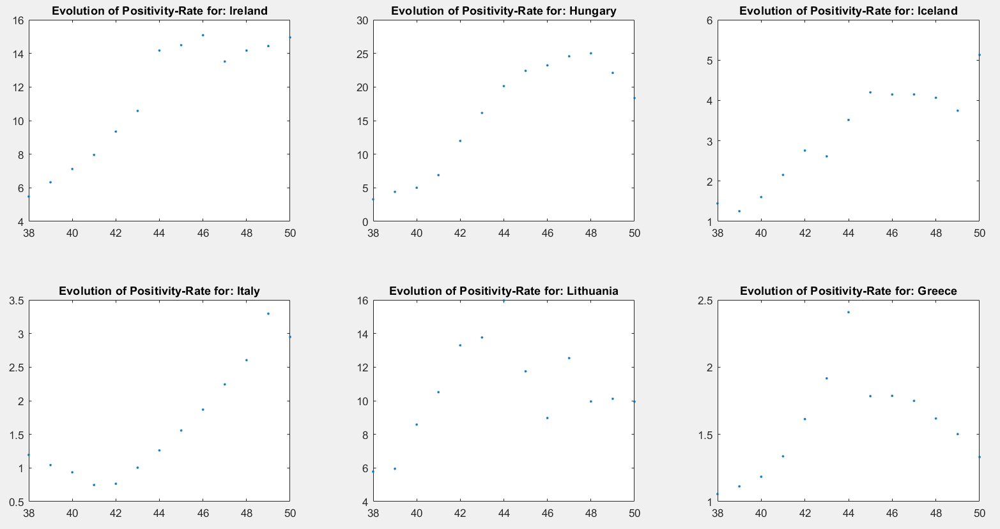

### Data Analysis: Covid-19
#### Introduction
This project is associated with the university course Data Analysis (7th semester) of the Department of Electrical and Computer Engineering at the Aristotle University of Thessaloniki (AUTh). The Matlab language has been used. Some files contain auxiliary functions (func files), which are used in the main files (prog files). All files are accompanied by helpful comments for explaining the code. The .xlsx files contain data about the COVID-19 pandemic and have been obtained from the website https://www.stelios67pi.eu.
The file ECDC-7Days-Testing.xlsx has weekly data for various countries of the European Union regarding the pandemic, while the file FullBodyData.xlsx provides more detailed information about the pandemic in Greece. Finally, the file EuropeanCountries.xlsx includes a list of all the European countries for which we have data.
This work mainly deals with Ireland and Greece, however, the functions used can be adapted with minor changes to any other desired country.
Lastly, the file named Project2021.pdf is the assignment description as it was given to us by the course instructor.

#### Exercise 1
In this question, we show the positivity rate of the countries for two different weeks. The results are presented in the following histograms:

The following image is a comparison between the two distributions that resulted for each week, to answer whether they can be approximated by a common distribution.

#### Exercise 3
Here, we want to determine when the weekly positivity index of Greece is statistically significantly different from that of the European Union. The results of the question are given in the following diagram, where the permissible deviation limits between the two values are also marked, which are the 95% bootstrap confidence intervals:

We observe that the positivity rate cannot be considered the same in all cases, such as in weeks 37 and 38.

#### Exercise 4
Now we compare the behavior of the positivity rate for certain countries, for specific weeks of 2020 and 2021, to see if they are similar. In the following diagrams of the results, we observe the difference in the mean values to determine if this is true (we are looking for a mean value close to 0). The diagrams for the countries Hungary, Iceland, Ireland, Italy, and Lithuania follow:

Even for this small sample of countries, the behavior is chaotic. Countries like Ireland have a noticeably higher positivity rate for the year 2021, in contrast to countries like Italy where the opposite is true. However, there are countries, such as Hungary, where the behavior can be considered similar between the two years we are studying.

#### Exercise 5
The objective of this question is to find the correlation of the positivity rates between Greece and the countries from the previous question. The calculation of the Pearson correlation coefficient is performed, and the significance of this coefficient is checked, both parametrically and randomly.
The results are as follows:

#### Correlation factors between Greece and foreign countries ( Parametric )
The pearson correlation between Greece and Ireland is rho = 0.65.  
The pearson correlation between Greece and Hungary is rho = 0.68.  
The pearson correlation between Greece and Iceland is rho = 0.50.  
The pearson correlation between Greece and Italy is rho = 0.04.  
The pearson correlation between Greece and Lithuania is rho = 0.87.

#### Significance Test for correlation about weekly positivity rate between Greece and foreign countries, using sigificance level of a =0.05 .

The p-value for hypothesis testing of no correlation is less than alpha=0.05. So there is  proof that there is correlation between Greece and Ireland weekly positivity rate.  
The p-value is 0.01655  

The p-value for hypothesis testing of no correlation is less than alpha=0.05. So there is  proof that there is correlation between Greece and Hungary weekly positivity rate.  
The p-value is 0.01009  

The p-value for hypothesis testing of no correlation is greater than alpha=0.05. So there is no proof that there is correlation between Greece and Iceland weekly positivity rate.  
The p-value is 0.07963  

The p-value for hypothesis testing of no correlation is greater than alpha=0.05. So there is no proof that there is correlation between Greece and Italy weekly positivity rate.  
The p-value is 0.88919  

The p-value for hypothesis testing of no correlation is less than alpha=0.05. So there is  proof that there is correlation between Greece and Lithuania weekly positivity rate.  
The p-value is 0.00011

#### Significance Test for correlation about weekly positivity rate between Greece and foreign countries, using sigificance level of a =0.01 .
The p-value for hypothesis testing of no correlation is greater than alpha=0.01. So there no is proof that there is correlation between Greece and Ireland weekly positivity rate.  
The p-value is 0.01655  

The p-value for hypothesis testing of no correlation is greater than alpha=0.01. So there no is proof that there is correlation between Greece and Hungary weekly positivity rate.  
The p-value is 0.01009  

The p-value for hypothesis testing of no correlation is greater than alpha=0.01. So there no is proof that there is correlation between Greece and Iceland weekly positivity rate.  
The p-value is 0.07963  

The p-value for hypothesis testing of no correlation is greater than alpha=0.01. So there no is proof that there is correlation between Greece and Italy weekly positivity rate.  
The p-value is 0.88919  

The p-value for hypothesis testing of no correlation is less than alpha=0.01. So there is  proof that there is correlation between Greece and Lithuania weekly positivity rate.  
The p-value is 0.00011

#### Correlation factors between Greece and foreign countries ( Randomization )
The pearson correlation between Greece and Ireland is rho = 0.65.  
The pearson correlation between Greece and Hungary is rho = 0.68.  
The pearson correlation between Greece and Iceland is rho = 0.50.  
The pearson correlation between Greece and Italy is rho = 0.04.  
The pearson correlation between Greece and Lithuania is rho = 0.87.

#### Significance Test for correlation about weekly positivity rate between Greece and foreign countries, using sigificance level of a =0.05 .
The p-value for hypothesis testing of no correlation is less than alpha=0.05. So there is  proof that there is correlation between Greece and Ireland weekly positivity rate.  
The p-value is 0.02997  

The p-value for hypothesis testing of no correlation is less than alpha=0.05. So there is  proof that there is correlation between Greece and Hungary weekly positivity rate.  
The p-value is 0.00599  

The p-value for hypothesis testing of no correlation is greater than alpha=0.05. So there is no proof that there is correlation between Greece and Iceland weekly positivity rate.  
The p-value is 0.10190  

The p-value for hypothesis testing of no correlation is greater than alpha=0.05. So there is no proof that there is correlation between Greece and Italy weekly positivity rate.  
The p-value is 0.86713  

The p-value for hypothesis testing of no correlation is less than alpha=0.05. So there is  proof that there is correlation between Greece and Lithuania weekly positivity rate.  
The p-value is 0.00000

#### Significance Test for correlation about weekly positivity rate between Greece and foreign countries, using sigificance level of a =0.01 .
The p-value for hypothesis testing of no correlation is greater than alpha=0.01. So there no is proof that there is correlation between Greece and Ireland weekly positivity rate.  
The p-value is 0.02997  

The p-value for hypothesis testing of no correlation is less than alpha=0.01. So there is  proof that there is correlation between Greece and Hungary weekly positivity rate.  
The p-value is 0.00599  

The p-value for hypothesis testing of no correlation is greater than alpha=0.01. So there no is proof that there is correlation between Greece and Iceland weekly positivity rate.  
The p-value is 0.10190  

The p-value for hypothesis testing of no correlation is greater than alpha=0.01. So there no is proof that there is correlation between Greece and Italy weekly positivity rate.  
The p-value is 0.86713  

The p-value for hypothesis testing of no correlation is less than alpha=0.01. So there is  proof that there is correlation between Greece and Lithuania weekly positivity rate.  
The p-value is 0.00000

#### Graph of the Positivity Rate for the countries under examination

#### Exercise 6
In this question, we aim to check if, for the two countries where the positivity rate correlates more with that of Greece, the difference in the corresponding coefficients is statistically significant.
After using the bootstrap technique to extract the rank, we arrive at the following conclusion:

The rank of the original difference of correlation factors between Greece and the other two countries (Hungary, Lithuania) is included in the acceptance area.
So we cannot reject the null Hypothesis, at a significance level of a=0.05. In that case we can say that there is no significant difference between the two correlation factors.

#### Exercise 7
The most effective models for the two samples

Sample 1: The best model is to take a delay of 0 weeks.
The R-square statistic to this choice is R^2 = 0.94852

Sample 2: The best model is to take a delay of 1 weeks.
The R-square statistic to this choice is R^2 = 0.90469

#### Contributors:
1.  Κωνσταντίνος Γερογιάννης  
   email: kostas.gerogiannis04@gmail.com  
   github: [kostaGRG](https://github.com/kostaGRG)

2. Σταύρος Τσιμπούκης
   email: statsimp@gmail.com
   github: 
   
   
